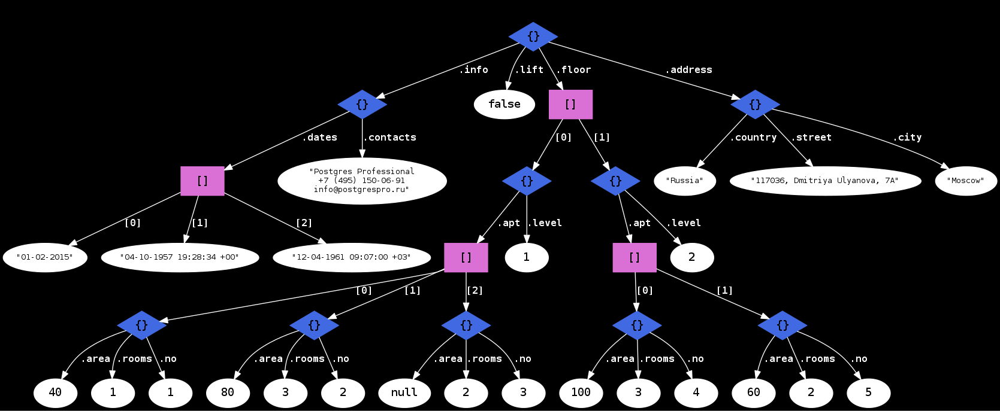

# Gentle Guide to JSONPATH in PostgreSQL

This document describes SQL/JSON implementation as committed to PostgreSQL 12, which consists of implementation of JSON Path - the JSON query language, and several functions and operators, which use the path language to work with jsonb data. Consider this document as a tutorial , the reference guide is available as a part of offical PostgreSQL documentation for release 12. 

Authors: Oleg Bartunov and Nikita Glukhov.

<P>

## Introduction to SQL/JSON

SQL-2016 standard doesn't describes the JSON data type, but instead it  introduced SQL/JSON data model (not  JSON data type like XML )  with string storage and path language used by certain SQL/JSON functions to query JSON.   SQL/JSON data model is a sequences of items, each of which is consists of SQL scalar values with an additional SQL/JSON null value,  and composite data structures using JSON arrays and objects.

PostgreSQL has two JSON  data types - the textual `json` data type to store an exact copy of the input text and the `jsonb` data type -   the binary storage for  JSON data converted to PostgreSQL types [(json primitive types and corresponding  PostgreSQL types)](https://www.postgresql.org/docs/current/static/datatype-json.html).  SQL/JSON data model adds datetime type to these primitive types, but it only used for comparison operators in path expression and stored on disk as a string.  Thus, `jsonb` data is already conforms to SQL/JSON data model (ORDERED and UNIQUE KEYS), while `json` should be converted according the mapping.  SQL-2016 standard describes two sets of SQL/JSON functions : constructor functions and query functions.  Constructor functions use values of SQL types and produce JSON values (JSON objects or JSON arrays) represented as SQL character or binary string types. Query functions evaluate SQL/JSON path language expressions against JSON values, producing values of SQL/JSON types, which are converted to SQL types.

## SQL/JSON Path language 

The main task of the path language is to specify the parts (the projection)  of JSON data to be retrieved by path engine for the  SQL/JSON query functions.  The language is designed to be flexible enough to meet the current needs and to be adaptable to the future use cases. Also, it is integratable into SQL engine, i.e., the semantics of predicates and operators generally follow SQL.  To be friendly to JSON users, the language resembles  JavaScript - dot(`.`)  used for member access and `[]` for array access, arrays starts from zero (SQL arrays starts from 1).

Example of two-floors house:
```sql
CREATE TABLE house(js) AS SELECT jsonb '
{
  "info": {
    "contacts": "Postgres Professional\n+7 (495) 150-06-91\ninfo@postgrespro.ru",
    "dates": ["01-02-2015", "04-10-1957 19:28:34 +00", "12-04-1961 09:07:00 +03"]
  },
  "address": {
    "country": "Russia",
    "city": "Moscow",
    "street": "117036, Dmitriya Ulyanova, 7A"
  },
  "lift": false,
  "floor": [
    {
      "level": 1,
      "apt": [
        {"no": 1, "area": 40, "rooms": 1},
        {"no": 2, "area": 80, "rooms": 3},
        {"no": 3, "area": null, "rooms": 2}
      ]
    },
    {
      "level": 2,
      "apt": [
        {"no": 4, "area": 100, "rooms": 3},
        {"no": 5, "area": 60, "rooms": 2}
      ]
    }
  ]
}
';
```
It can be illustrated as a json tree:



 Consider the following path expression:
```sql
'$.floor[*].apt[*] ? (@.area > 40 && @.area < 90)'
```
The result of this path expression will be information about apartments with rooms, which area is  in specified range. Dollar sign `$`  designates a __context item__ or the whole JSON document, which describes a house with floors ( `floor[]`), apartments (`apt[]`)  with rooms and room has attribute `area`.  Expression `$.floor[*].apt[*]` in described context means  __any__ room, which filtered by a filter expression (in parentheses).  At sign `@` in filter designates the __current item__ in filter.   Path expression could have more filters (applied  left to right) and each of them may be nested. 
```sql
'$.floor[*].apt[*] ? (@.area > 40 && @.area < 90) ? (@.rooms > 2)'
```
It's possible to use the __path variables__ in path expression, whose values are set in __`PASSING`__ clause of invoked SQL/JSON function (not implemented in PostgreSQL 12). For example (js is a column of type JSON):
```sql
SELECT JSON_QUERY(js, '$.floor[*].apt[*] ? (@.area > $min && @.area < $max)' PASSING 40 AS min, 90 AS max WITH WRAPPER) FROM house;
                               json_query
------------------------------------------------------------------------
 [{"no": 2, "area": 80, "rooms": 3}, {"no": 5, "area": 60, "rooms": 2}]
(1 row)
```
__`WITH WRAPPER`__ clause  is used to wrap the results into array, since  `JSON_QUERY` output should be  JSON text.  If minimal and maximal values are stored in table `area (min integer, max integer)`, then it is possible to pass them to the path expression:
```sql
SELECT JSON_QUERY(
  house.js, '$.floor[*].apt[*] ? (@.area > $min && @.area < $max)'
  PASSING area.min AS min,
          area.max AS max
  WITH WRAPPER
  EMPTY ARRAY ON EMPTY
)
FROM
  house,
  (VALUES (30, 50), (70, 120), (200, 300)) area(min, max);
                               json_query                                
-------------------------------------------------------------------------
 [{"no": 1, "area": 40, "rooms": 1}]
 [{"no": 2, "area": 80, "rooms": 3}, {"no": 4, "area": 100, "rooms": 3}]
 []
(3 rows)

```
Example of using several filters in json path expression, which returns room number (integer) and the room should satisfies the several conditions: the one is checking floor level and another - its area.
```sql
SELECT JSON_VALUE(js, '$.floor[*] ? (@.level > 1).apt[*] ? (@.area > 40 && @.area < 90).no' RETURNING int) FROM house;
 json_value
------------
     5
(1 row)
```

Path expression may contains several  __item methods__ (out of eight predefined functions), which applies to the result of preceding path expression. For example,  item method `.double()` converts `area` into a double number.
```sql
'$.floor[0].apt[1].area.double()'
```
More complex example with __keyvalue()__ method, which outputs an array of  room numbers. 
```sql
SELECT JSON_QUERY( js , '$.floor[*].apt[*].keyvalue() ? (@.key == "no").value' WITH WRAPPER) FROM house;
   json_query
-----------------
 [1, 2, 3, 4, 5]
(1 row)
```

## JSONPATH in PostgreSQL

In PostgreSQL the SQL/JSON path language is implemented as  **`JSONPATH`**  data type - the binary representation of parsed SQL/JSON path expression to effective query JSON data.  **Path expression** is an optional  path mode ``strict` or `lax` (default), followed by a  path or unary/binary expression on paths. Path is a sequence of path elements,  started from path variable, path literal or  expression in parentheses and zero or more operators ( JSON accessors, filters, and item methods ).

Examples of vaild `jsonpath`:
```sql
'$' -- the whole JSON document (context item)
'$foo' -- variable "foo"
'"bar"' -- string literal
'12.345' -- numeric literal
'true' -- boolean literal
'null' -- null
'$.floor' -- field accessor on $
'$.floor[*]' -- the same, followed by wildcard array accessor

-- complex path with filters and variables
'$.floor[*] ? (@.level < $max_level).apt[*] ? (@.area > $min_area).no'

-- arithmetic expressions:
'-$.a[*]' -- unary
'$.a + 3' -- binary
'2 * $.a - (3 / $.b + $x.y)' -- complex expression with variables

-- parenthesized expression used as starting element of a path,
-- followed by two item methods ".abs()" and ".ceil()"
'($ + 1).abs().ceil()'

'$.floor[*].apt[*].area > 10' -- boolean predicate (extension)
```
`Jsonpath` in SQL/JSON functions could be an expression (extension to standard):
```sql
JSON_QUERY('{"a": 1}', '$' || '.' || 'a')
```

Syntactical errors in `jsonpath` are reported
```sql
SELECT '$a. >1'::jsonpath;
ERROR:  bad jsonpath representation at character 8
DETAIL:  syntax error, unexpected GREATER_P at or near ">"
```
An [Example](#how-path-expression-works) of how path expression works.

### `Jsonpath` functions

* `jsonb_path_exists()`, returns `boolean`. Test whether a JSON path expression returns any SQL/JSON items.
* `jsonb_path_match()`,  returns `boolean`. Evaluate JSON path predicate.
* `jsonb_path_query()`, returns `setof jsonb`. Extract a sequence of SQL/JSON items from a JSON value.
* `jsonb_path_query_array()`, returns `jsonb`. Extract a sequence of SQL/JSON items wrapped into JSON array.
* `jsonb_path_query_first()`, returns `jsonb`. Extract the first SQL/JSON item from a JSON value.

All `jsonb_path_xxx()` functions have the same signature:
```sql
jsonb_path_xxx(
    js jsonb,
    jsp jsonpath,
    vars jsonb DEFAULT '{}',
    silent boolean DEFAULT false
)
```
`vars` is a jsonb object used for passing jsonpath variables:
```sql
SELECT jsonb_path_query_array('[1,2,3,4,5]', '$[*] ? (@ > $x)', vars => '{"x": 2}');
 jsonb_path_query_array 
------------------------
 [3, 4, 5]
 -- comparison with any element of $x: @ ? $x[0] || @ > $x[1]
 SELECT jsonb_path_query_array('[1,2,3,4,5]', '$[*] ? (@ > $x[*])', vars => '{"x": [3, 2]}');
 jsonb_path_query_array 
------------------------
 [3, 4, 5]
```

`silent` flag enables suppression of errors:
```sql
SELECT jsonb_path_query('[]', 'strict $.a');
ERROR:  SQL/JSON member not found
DETAIL:  jsonpath member accessor can only be applied to an object

SELECT jsonb_path_query('[]', 'strict $.a', silent => true);
 jsonb_path_query 
------------------
(0 rows)
```

#### Examples ####

To run an example write `SELECT` before function call, for example:
```sql
SELECT jsonb_path_exists('{"a": 1}', '$.a');
```

```sql
jsonb_path_exists('{"a": 1}', '$.a') => true
jsonb_path_exists('{"a": 1}', '$.b') => false

jsonb_path_match('{"a": 1}', '$.a == 1') => true
jsonb_path_match('{"a": 1}', '$.a >= 2') => false

jsonb_path_query('{"a": [1,2,3,4,5]}','$.a[*] ? (@ > 2)') => 3, 4, 5 (3 rows)
jsonb_path_query('{"a": [1,2,3,4,5]}', '$.a[*] ? (@ > 5)') =>  (0 rows)

jsonb_path_query_array('{"a": [1,2,3,4,5]}','$.a[*] ? (@ > 2)') => [3, 4, 5]
jsonb_path_query_array('{"a": [1,2,3,4,5]}','$.a[*] ? (@ > 5)') => []

jsonb_path_query_first('{"a": [1,2,3,4,5]}','$.a[*] ? (@ > 2)') => 3
jsonb_path_query_first('{"a": [1,2,3,4,5]}','$.a[*] ? (@ > 5)') => NULL
```
### `Jsonpath` operators

To accelerate JSON path queries using existing indexes for `jsonb`  (GIN index using built-in  `jsonb_ops` or `jsonb_path_ops`)  PostgreSQL extends the standard with two  boolean operators for `json[b]` and `jsonpath` data types.

* `json[b] @? jsonpath` -  exists  operator, returns bool.  Check that path expression returns non-empty SQL/JSON sequence.
* `json[b] @@ jsonpath` - match operator, returns the result of JSON path predicate.

```sql
SELECT js @?  '$.floor[*].apt[*] ? (@.area > 40 && @.area < 90)' FROM house;
 ?column?
----------
 t
(1 row)

SELECT js @@  '$.floor[*].apt[*].area < 20' FROM house;
 ?column?
----------
 f
(1 row)
```

* Operators `@?` and `@@` are interchangeable:
```sql
js @? '$.a'      <=>  js @@ 'exists($.a)'
js @@ '$.a == 1' <=>  js @? '$ ? ($.a == 1)'
```

The performance of `jsonb @? jsonpath` and `jsonb @@ jsonpath` are the same as `jsonb @> jsonb`  (for equality operation), but `jsonpath` supports more complex expressions.

### Path modes

The path engine has two modes, strict and lax, the latter is  default, that is,  the standard tries to facilitate matching of the  (sloppy) document structure and path expression.

 In __lax__ mode the path engine:

 * suppresses the structural errors and  converts them to the empty SQL/JSON sequences.
```sql
SELECT jsonb '{"a":1}' @? 'lax $.b ? (@ > 1)';
 ?column?
----------
 f
```
* unwraps arrays.
```sql
SELECT jsonb '[1,2,[3,4,5]]' @? 'lax $[*] ? (@ == 5)';
 ?column?       
----------
 t
 SELECT jsonb '[1,2,[3,4,5]]' @? 'lax $ ? (@ == 5)';
 ?column?        
----------
 t
```

In __strict__ mode structural errors (missing keys) resulted  `null` 
```sql
SELECT jsonb '{"a":1}' @? 'strict $.b ? (@ > 1)';
 ?column?
----------
 (null)
```
and requires an exact nesting in jsonpath expression.
```sql
SELECT jsonb '[1,2,[3,4,5]]' @? 'strict $[*] ? (@[*] == 5)';
 ?column?
----------
 t
 SELECT jsonb '[1,2,[3,4,5]]' @? 'strict $[*] ? (@ == 5)';
 ?column?
----------
 f
```

### Path Elements

__path literal__

JSON primitive types:
 * unicode text (`"foo"`)
 * numeric (`123`, `12.345`, `1.23e+45`)
 * boolean (`true`, `false`)
 * `null`

__path variable__
 * `$` -- context item
 * `$var` -- named variable, value is set in `PASSING` clause
 * `@` -- value of the current item in a filter
 * `last` - JSON last subscript of an array

__expression in parentheses__
 *  `($a + 2)`

__Path elements__ 
 * __member accessor__  -- `.name` or `."$name"`.  It is used to access a member of an object by key name.  If the key name does not begin with a dollar sign and meets the JavaScript rules of an Identifier, then the member name can be written in clear text, else it can be written as a character string literal. For example: `$.color, "$."color of a pen"`.  In __strict__ mode, every SQL/JSON item in the SQL/JSON sequence must be an object with a member having the specified key name. If this condition is not met, the result is an error.  In __lax__ mode, any SQL/JSON array in the SQL/JSON sequence is unwrapped. Unwrapping only goes **one deep**; that is, if there is an array of arrays, the outermost array is unwrapped, leaving the inner arrays alone.

 
 * __wildcard member accessor__  --  `.*`, the values of all attributes of the current  object.  In __strict__ mode, every SQL/JSON item in the SQL/JSON sequence must be an object. If this condition is not met, the result is an error. In __lax__ mode, any SQL/JSON array in the SQL/JSON sequence is unwrapped.
 
 * __array element accessor__  -- `[1,5 to LAST]`, the second and the six-th to the last array elements of the array . Since jsonpath follows javascript conventions rather than SQL, `[0]` accesses is the first element in the array. `LAST` is the special variable to handle arrays of unknown length, its value is the size of the array minus 1.   In the __strict__ mode, subscripts must be singleton numeric values between 0 and last; in __lax__ mode, any subscripts that are out of bound are simply ignored. In both __strict__ and __lax__ mode, non-numeric subscripts are an error.
 
 * __wildcard array element accessor__ -- `[*]`, all array elements. In __strict__ mode, the operand must be an array, in __lax__ mode, if the operand is not an array, then one is provided by wrapping it in an array before unwrapping, `$[*]` is the same as `$[0 to last]`.  The latter is not valid in __strict__ mode, since `$[0 to last]` requires at least one array element and raise an error if `$` is the empty array , while `$[*]`  returns `null` in that case.
 * __filter expression__ --  `? (expression)` , the result of filter expression may be `unknown`, `true`,  `false`. 
 * __item method__ -- is the function, that operate on an SQL/JSON item and return an SQL/JSON item. 
It denotes as  `.` and could be one of the 8 methods:

  - __type()__ - returns a character string that names the type of the SQL/JSON item ( PostgreSQL 12 supports `"null"`, `"boolean"`, `"number"`, `"string"`, `"array"`, `"object"`).
   
  - __size()__ -  returns the size of an SQL/JSON item, which is the number of elements in the array or 1 for SQL/JSON object or scalar in __lax__ mode  and error `ERROR:  SQL/JSON array not found` in __strict__ mode.  
```sql
SELECT jsonb_path_query('{"a": [1,2,3,4,5]}', '$.a[*] ? (@ > 2).type().size()');
 jsonb_path_query
------------------
 1
 1
 1
(3 rows)

SELECT jsonb_path_query('{"a": [1,2,3,4,5]}', 'strict $.a[*] ? (@ > 2).type().size()');
ERROR:  SQL/JSON array not found
DETAIL:  jsonpath item method .size() can only be applied to an array
```
In more complex case,  we can wrap SQL/JSON sequence into an array and apply `.size()` to the result:
```sql
 SELECT JSON_VALUE(JSON_QUERY('[1,2,3]', '$[*] ? (@ > 1)' WITH WRAPPER), '$.size()' RETURNING int);
 json_value
------------
     2
(1 row)
 ```
 
   - __`ceiling()`__ - the same as `CEILING` in SQL
   - __`double()`__ - converts a string or numeric to an approximate numeric value.
   - __`floor()`__ - the same as `FLOOR` in SQL
   - __`abs()`__  - the same as `ABS` in SQL
   - __`keyvalue()`__ - transforms json to an SQL/JSON sequence of objects with a known schema. 
   Example:
   ```sql
   SELECT jsonb_path_query( '{"a": {"x": 123}, "b": {"y": 456}, "c": {"z": 789}}', '$.*.keyvalue()');
           jsonb_path_query
--------------------------------------
 {"id": 32, "key": "x", "value": 123}
 {"id": 56, "key": "y", "value": 456}
 {"id": 80, "key": "z", "value": 789}
(3 rows)
```
`id` is a PostgreSQL specific identificator of object from `key,value` pair originates.
```sql
SELECT jsonb_path_query( '{"a": {"x": 123, "y": 456}, "c": {"z": 789}}', '$.*.keyvalue()');
           jsonb_path_query
--------------------------------------
 {"id": 24, "key": "x", "value": 123}
 {"id": 24, "key": "y", "value": 456}
 {"id": 64, "key": "z", "value": 789}
(3 rows)

 -- reconstruct objects grouping by "id"
SELECT json_object_agg(kv->>'key', kv->'value') FROM 
jsonb_path_query( '{"a": {"x": 123, "y": 456}, "c": {"z": 789}}', '$.*.keyvalue()') kv 
GROUP BY kv->'id';
     json_object_agg
--------------------------
 { "x" : 123, "y" : 456 }
 { "z" : 789 }
(2 rows)
```


 **PostgreSQL extensions**:
   1.  __recursive wildcard member accessor__ -- `.**`,  recursively applies wildcard member accessor `.*` to all levels of hierarchy and returns   the values of **all** attributes of the current object regardless of the level of the hierarchy.  It is possible to specify a level or range of the tree to unwrap -- `.**{2}`, `.**{2 TO LAST}`.
Examples:

```sql
-- Wildcard member accessor returns the values of all elements without looking deep.
SELECT jsonb_path_query( '{"a":{"b":[1,2]}, "c":1}','$.*');
 jsonb_path_query
------------------
 {"b": [1, 2]}
 1
(2 rows)

--  Recursive wildcard member accessor "unwraps"  all objects and arrays
SELECT jsonb_path_query( '{"a":{"b":[1,2]}, "c":1}','$.**');
       jsonb_path_query
------------------------------
 {"a": {"b": [1, 2]}, "c": 1}
 {"b": [1, 2]}
 [1, 2]
 1
 2
 1
(6 rows)

-- Specify range 
SELECT jsonb_path_query( '{"a":{"b":[1,2]}, "c":1}','$.**{2 to last}');
 jsonb_path_query
------------------
 [1, 2]
 1
 2
(3 rows)
```
   
 ### Filter expression
 
A filter expression is similar to a `WHERE` clause in SQL, it is used to remove SQL/JSON items from an SQL/JSON sequence if they do not satisfy a predicate. The syntax uses a question mark `?` followed by a parenthesized predicate. In __lax__ mode, any SQL/JSON arrays in the operand are automatically unwrapped. The predicate is evaluated for each SQL/JSON item in the SQL/JSON sequence.  Predicate returns `Unknown` (SQL NULL) if any error occured during evaluation of its operands and execution. The result is those SQL/JSON items for which the predicate resulted in `True`, `False` and `Unknown` are rejected. 

Within a filter, the special variable `@` is used to reference the current SQL/JSON item in the SQL/JSON sequence.

The SQL/JSON path language has the following predicates:

 - `exists` predicate, test if a path expression has a non-empty result.
 - Comparison predicates `==`, `!=`, `<>`, `<`, `<=`, `>`, and `>=`.
 - `like_regex` for string pattern matching.  Optional parameter`flag` can be combination of `i`, `s` (default), `m`, `x`.
 - `starts with` to test for an initial substring (prefix).
 - `is unknown` to test for `Unknown` results. Its operand should be in parentheses.

JSON literals `true, false` are parsed into the SQL/JSON model as the SQL boolean values `True` and `False`. 
```sql
SELECT jsonb_path_query(jsonb 'true','$ ? (@ == true)') FROM house;
 jsonb_path_query
------------------
 true
(1 row)
SELECT jsonb_path_query(jsonb '{"g": {"x": 2}}','$.g ? (exists (@.x))');
 jsonb_path_query
------------------
 {"x": 2}
(1 row)
```
JSON literal `null` is parsed into the special SQL/JSON value `null`, which differs from SQL NULL, for example, SQL JSON `null` is equal to itself, so the result of `null == null` is `True`.
```sql
SELECT jsonb_path_exists('1', '$ ? (null == null)');
 jsonb_path_exists
-------------------
 t
(1 row)
SELECT jsonb_path_query('1', '$ ? (null != null)');
 jsonb_path_query
------------------
(0 rows)
``` 
Prefix search with `starts with` example:
```sql
SELECT jsonb_path_query(js, '$.** ? (@ starts with "11")') from house;
        jsonb_path_query
---------------------------------
 "117036, Dmitriya Ulyanova, 7A"
(1 row)
```
Regular expression search:
```sql
-- case insensitive
SELECT jsonb_path_query(js, '$.** ? (@ like_regex "O(w|v)" flag "i")') from house;
        jsonb_path_query
---------------------------------
 "Moscow"
 "117036, Dmitriya Ulyanova, 7A"
(2 rows)
-- ignore spaces in query, flag "x"
SELECT jsonb_path_query(js, '$.** ? (@ like_regex "O w|o V" flag "ix")') from house;
        jsonb_path_query
---------------------------------
 "Moscow"
 "117036, Dmitriya Ulyanova, 7A"
(2 rows)
-- single-line mode, flag "s".
SELECT jsonb_path_query(js, '$.** ? (@ like_regex "^info@" flag "is")') from house;
 jsonb_path_query
------------------
(0 rows)
-- multi-line mode, flag "m"
SELECT jsonb_path_query(js, '$.** ? (@ like_regex "^info@" flag "im")') from house;
                         jsonb_path_query
------------------------------------------------------------------
 "Postgres Professional\n+7 (495) 150-06-91\ninfo@postgrespro.ru"
(1 row)
```


Predicate `is unknown` can be used to filter "problematic" SQL/JSON items. Notice, that filter expression automatically unwraps array `apt`, since default mode is `lax`.
```sql
SELECT jsonb_path_query(js,'$.floor.apt ? ((@.area / @.rooms > 0))') from house;
          jsonb_path_query
------------------------------------
 {"no": 1, "area": 40, "rooms": 1}
 {"no": 2, "area": 80, "rooms": 3}
 {"no": 4, "area": 100, "rooms": 3}
 {"no": 5, "area": 60, "rooms": 2}
(4 rows)
-- what item was rejected by a filter ?
SELECT jsonb_path_query(js,'$.floor.apt ? ((@.area / @.rooms > 0) is unknown)') from house;
          jsonb_path_query
-------------------------------------
 {"no": 3, "area": null, "rooms": 2}
(1 row)
```

### Arithmetic expressions

Unary arithmetic operators (`+` and `-`) can be applied to the sequences of arbitrary length:
```sql
SELECT jsonb_path_query_array(js, '-$.floor[*].apt[*].area ? (@.type() == "number")') FROM house;
 jsonb_path_query_array
------------------------
 [-40, -80, -100, -60]
(1 row)
```

Binary arithmetic operators (`+`, `-`, `*`, `/`, `%`) require both operands to return singleton numeric items:
```sql
SELECT jsonb_path_query(js, '$.floor[*].apt[*].area ? (@.type() == "number") + 10') FROM house;
ERROR:  left operand of jsonpath operator + is not a single numeric value

SELECT jsonb_path_query(js, '$.floor[*].apt[*].area ? (@ == 100) + 10') FROM house;
 jsonb_path_query
------------------
 110
(1 row)
```

### How path expression works

Path expression is intended to produce an SQL/JSON sequence ( an ordered list of zero or more SQL/JSON items) and completion code for  SQL/JSON query functions or operator, whose job is to process that result using the particular SQL/JSON query operator. The path engine process path expression step by step, each of which produces SQL/JSON sequence for following step. For example,  path expression  
```sql
'$.floor[*].apt[*] ? (@.area > 40 && @.area < 90)'
```
at first step produces SQL/JSON sequence of length 1, which is simply json itself - the context item, denoted as `$`.  Next step is member accessor `.floor` - the result is SQL/JSON sequence of length 1 - an array `floor`, which then unwrapped by  wildcard  array element accessor  `[*]` to SQL/JSON sequence of length 2, containing an array of two objects . Next, `.apt`  produces two arrays of objects and `[*]` extracts  SQL/JSON sequence of length 5 ( five objects - appartments), each of which filtered by a filter expression `(@.area > 40 && @.area < 90)`, so a result of the whole path expression  is a sequence of two SQL/JSON items.

```sql
SELECT jsonb_path_query_array(js,'$.floor[*].apt[*] ? (@.area > 40 && @.area < 90)') FROM house;
                         jsonb_path_query_array
------------------------------------------------------------------------
 [{"no": 2, "area": 80, "rooms": 3}, {"no": 5, "area": 60, "rooms": 2}]
(1 row)
```
#### Indexing ####

Operators exists `@?` and match `@`  can be speeded up by GIN index using built-in `jsonb_ops` or `jsonb_path_ops` opclasses (one can use existing indexes). 

To run examples first download `http://www.sai.msu.su/~megera/postgres/files/bookmarks.jsonb.sql.gz`, load it into PostgreSQL and create index:
```sql 
1. curl -O http://www.sai.msu.su/~megera/postgres/files/bookmarks.jsonb.sql.gz
2. zcat bookmarks.jsonb.sql.gz | psql
3. CREATE index ON bookmarks USING gin(jb jsonb_path_ops); 
```
Examples:
```sql
EXPLAIN (analyze, costs off) 
SELECT COUNT(*) FROM bookmarks
WHERE jb @? '$.tags[*] ? (@.term == "NYC")';
                                           QUERY PLAN
------------------------------------------------------------------------------------------------
 Aggregate (actual time=0.608..0.608 rows=1 loops=1)
   ->  Bitmap Heap Scan on bookmarks (actual time=0.121..0.578 rows=285 loops=1)
         Recheck Cond: (jb @? '$."tags"[*]?(@."term" == "NYC")'::jsonpath)
         Heap Blocks: exact=285
         ->  Bitmap Index Scan on bookmarks_jb_idx1 (actual time=0.082..0.082 rows=285 loops=1)
               Index Cond: (jb @? '$."tags"[*]?(@."term" == "NYC")'::jsonpath)
 Planning Time: 0.072 ms
 Execution Time: 0.642 ms ( seqscan 1000 ms, speedup ~ 1500 )
(8 rows)


```

Find all authors with the same bookmarks as the given author (join query):

```sql
EXPLAIN (ANALYZE, COSTS OFF, TIMING OFF)
SELECT
  b1.jb->'author'
FROM
  bookmarks b1,
  bookmarks b2
WHERE
  b1.jb @@ format('$.title == %s && $.author != %s', b2.jb -> 'title', b2.jb -> 'author')::jsonpath AND
  b2.jb @@ '$.author == "ant.on"'::jsonpath;
  QUERY PLAN
--------------------------------------------------------------------------------------------------------
   Gather (actual rows=1222 loops=1)
   Workers Planned: 1
   Workers Launched: 1
   ->  Nested Loop (actual rows=611 loops=2)
         ->  Parallel Bitmap Heap Scan on bookmarks b2 (actual rows=5 loops=2)
               Recheck Cond: (jb @@ '($."author" == "ant.on")'::jsonpath)
               Heap Blocks: exact=3
               ->  Bitmap Index Scan on bookmarks_jb_idx1 (actual rows=10 loops=1)
                     Index Cond: (jb @@ '($."author" == "ant.on")'::jsonpath)
         ->  Bitmap Heap Scan on bookmarks b1 (actual rows=122 loops=10)
               Recheck Cond: (jb @@ (format('$.title == %s && $.author != %s'::text, (b2.jb -> 'title'::text), (b2.jb -> 'author'::text)))::jsonpath)
               Rows Removed by Index Recheck: 1
               Heap Blocks: exact=1138
               ->  Bitmap Index Scan on bookmarks_jb_idx1 (actual rows=123 loops=10)
                     Index Cond: (jb @@ (format('$.title == %s && $.author != %s'::text, (b2.jb -> 'title'::text), (b2.jb -> 'author'::text)))::jsonpath)
 Planning Time: 0.169 ms
 Execution Time: 7.707 ms (seqscan 35310.417 ms, speedup ~ 4600 )
(17 rows)

```

`Jsquery` extension (sqljson branch) provides additional GIN opclasses for jsonpath:
* `jsonb_path_value_ops` - best for exact and range queries on values, exact path searches
* `jsonb_laxpath_value_ops` - the same as above, but skips array path items from the hashing and greatly simplifies extraction of lax JSON path queries. 
* `jsonb_value_path_ops` - good for exact value searches  and wildcard path queries.


## SQL/JSON conformance

- `like_regex` supports posix regular expressions,  while the  standard requires xquery regexps.
- `json_path_specification` extended to be an expression of `jsonpath` type. The standard requires `character_string_literal`.
-  Use boolean  expression on the path, PostgreSQL extension.
- `.**`  - recursive wildcard member accessor, PostgreSQL extension.
- `json[b] op jsonpath` - PostgreSQL extension.
- `datetime` is not supported in PostgreSQL 12.
```sql
-- behavior required by standard
SELECT jsonb_path_query('"13.03.2019"', '$.datetime("DD.MM.YYYY")');
 jsonb_path_query 
------------------
 "2019-03-13"
(1 row)

-- behavior of PostgreSQL 12
SELECT jsonb_path_query('"13.03.2019"', '$.datetime("DD.MM.YYYY")');
ERROR:  bad jsonpath representation
```


PostgreSQL 12 has __the most complete__ implementation of JSON Path.

<table style="float:right">
<tr>
<td>SQL/JSON feature</td><td>PostgreSQL 12</td><td>Oracle 18c</td><td>MySQL 8.0.4</td><td> SQL Server 2017</td>
</tr>
<tr>
<td>JSON Path (15)</td align="center"><td align="center">14/15</td><td align="center"> 11/15</td><td align="center">5/15</td><td align="center">2/15</td>
</tr>
</table>

## SQL/JSON Roadmap
* SQL/JSON functions from SQL-2016 standard
* `datetime` support in JSON Path
* Parameters for opclasses - specify parts of jsonb to index using jsonpath
http://www.sai.msu.su/~megera/postgres/talks/opclass_pgcon-2018.pdf
* Jsquery GIN opclasses to core
* Extend jsonpath syntax (array,object,sequence construction, object subscripting, lambda expressions, user-defined item methods and functions)
* COPY with support of jsonpath

 ## Links
* Full implementation of SQL/JSON (expected in PostgreSQL 13)
https://github.com/postgrespro/sqljson
*  WEB-interface to play with SQL/JSON
http://sqlfiddle.postgrespro.ru/#!21/0/2379
* Technical Report (SQL/JSON) - available for free
http://standards.iso.org/i/PubliclyAvailableStandards/c067367_ISO_IEC_TR_19075-6_2017.zip
* Jsquery - PostgreSQL extension for json
https://github.com/postgrespro/jsquery/tree/sqljson
* Jsonb roadmap - talk at PGConf.eu, 2018
http://www.sai.msu.su/~megera/postgres/talks/sqljson-pgconf.eu-2017.pdf